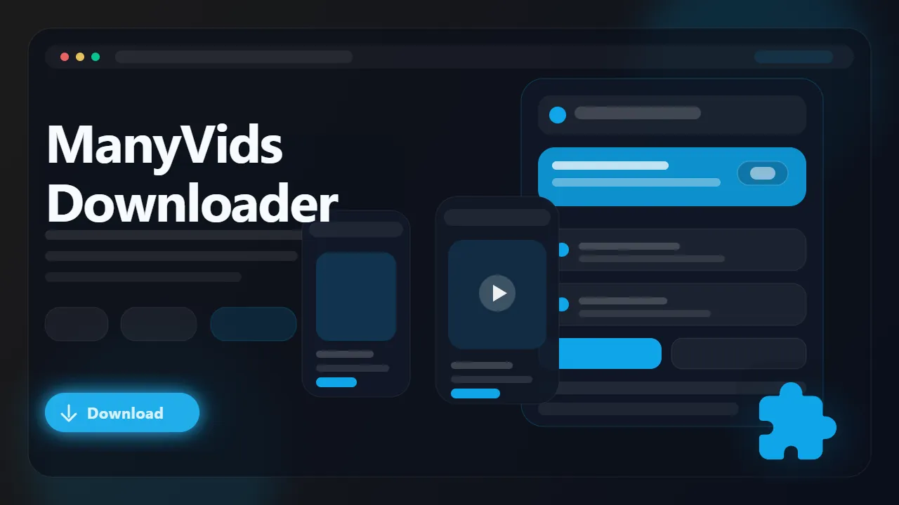

# ManyVids Downloader (Browser Extension)

> Download supported ManyVids videos as MP4 files from the browser with direct quality selection.

ManyVids Downloader is a browser extension for users who want a cleaner way to save supported ManyVids videos without relying on generic downloader sites or external software. It detects supported video pages in the browser, exposes the available qualities, and exports finished downloads as MP4 for easier playback later.

- Download supported ManyVids videos directly from the page
- Choose from the quality options exposed by the source
- Save finished files as standard MP4
- Use in-page controls, popup controls, or right-click actions
- Keep downloads organized in a dedicated folder

## Links

- :rocket: Get it here: [ManyVids Downloader](https://serp.ly/manyvids-downloader)
- :new: Latest release: [GitHub Releases](https://github.com/serpapps/manyvids-downloader/releases/latest)
- :question: Help center: [SERP Help](https://help.serp.co/en/)
- :beetle: Report bugs: [GitHub Issues](https://github.com/serpapps/manyvids-downloader/issues)
- :bulb: Request features: [Feature Requests](https://github.com/serpapps/manyvids-downloader/issues)

## Preview

## Table of Contents

- [Why ManyVids Downloader](#why-manyvids-downloader)
- [Features](#features)
- [How It Works](#how-it-works)
- [Step-by-Step Tutorial: How to Download Videos from ManyVids](#step-by-step-tutorial-how-to-download-videos-from-manyvids)
- [Supported Formats](#supported-formats)
- [Who It's For](#who-its-for)
- [Common Use Cases](#common-use-cases)
- [Troubleshooting](#troubleshooting)
- [Trial & Access](#trial--access)
- [Installation Instructions](#installation-instructions)
- [FAQ](#faq)
- [Notes](#notes)
- [License](#license)
- [About ManyVids](#about-manyvids)

## Why ManyVids Downloader

ManyVids pages are built for streaming playback, not for straightforward local saving. Supported video pages may expose media through different player flows, which makes generic downloader tools inconsistent and awkward for users who want a direct browser-based workflow.

ManyVids Downloader is built specifically for that use case. It focuses on supported ManyVids video pages, detects the available media in your browser session, and gives you a direct way to export accessible content as MP4.

## Features

- Video detection for supported ManyVids video pages
- Multi-source handling for common ManyVids player delivery paths
- Quality selection for available stream resolutions
- MP4 export for easier offline playback
- In-page controls on supported video pages
- Popup workflow for reviewing detected video options
- Right-click access for a faster download flow
- Progress tracking during active downloads
- Cross-browser support for Chrome, Edge, Brave, Opera, Firefox, Whale, and Yandex

## How It Works

1. Install the extension from the latest release.
2. Open a supported ManyVids video page.
3. Start playback so the extension can detect the video source.
4. Open the popup or use the on-page control.
5. Choose the quality you want.
6. Download the video and save the final MP4 file locally.

## Step-by-Step Tutorial: How to Download Videos from ManyVids

1. Install ManyVids Downloader from the latest GitHub release.
2. Sign in to ManyVids if the page requires account access.
3. Open the supported video page you want to save.
4. Let the player load fully and press play.
5. Click the extension button or the on-page download control.
6. Review the detected quality options.
7. Start the download and wait for the MP4 export to complete.
8. Open the saved file from your Downloads folder.

## Supported Formats

- Input: Supported ManyVids video sources
- Output: MP4

Saved files use MP4 so they are easier to replay on standard media players, move between devices, and keep in a local archive.

## Who It's For

- ManyVids users saving videos they already have access to
- Creators archiving their own published content
- Users who want offline viewing without repeated streaming
- Anyone who wants a browser-based workflow instead of external tools
- Non-technical users who want a simpler way to save video pages

## Common Use Cases

- Save a supported ManyVids video for offline playback
- Download a video in the best available quality
- Keep a local copy of content you have purchased or own
- Archive creator content for your own records
- Use a direct browser workflow instead of a manual workaround

## Troubleshooting

**The extension is not detecting the video**  
Press play first and wait a few seconds so the video source has time to initialize.

**No quality options are listed**  
Some pages expose only one playable variant.

**The download did not start**  
Refresh the page, replay the video, and try again once the player is fully loaded.

**The page requires login or purchase access**  
The extension only works on videos you can already access in your active ManyVids session.

**The page structure looks unusual**  
Some videos may use a different delivery setup than the usual player flow, which can affect detection.

## Trial & Access

- Includes **3 free downloads** so you can test the workflow first
- Email sign-in uses secure one-time password verification
- No credit card required for the trial
- Unlimited downloads are available with a paid license

Start here: [https://serp.ly/manyvids-downloader](https://serp.ly/manyvids-downloader)

## Installation Instructions

1. Open the latest release page:
   [https://github.com/serpapps/manyvids-downloader/releases/latest](https://github.com/serpapps/manyvids-downloader/releases/latest)
2. Download the extension build for your browser.
3. Install the extension.
4. Open a supported ManyVids video page.
5. Use the extension controls to detect and download the video.

## FAQ

**Can I download ManyVids videos as MP4?**  
Yes. Supported video pages can be exported as MP4 files.

**Do I need to press play first?**  
Yes. Many video sources are only exposed after playback begins.

**What file format do downloads use?**  
Videos are saved as MP4 files.

**Do I need extra software?**  
No. Everything runs through the browser extension.

**Can creators use it to archive their own content?**  
Yes, as long as the content is accessible in the active browser session.

## Notes

- Only download content you own or have explicit permission to save
- The extension only works on media you can already play in your browser session
- Video quality depends on the source stream exposed on that page
- An internet connection is required for the initial download

## License

This repository includes an MIT license in [LICENSE.md](LICENSE.md).

## About ManyVids

ManyVids is a creator platform built around hosted video content and member-access pages. Because playback is designed for streaming inside the site, there is no simple universal built-in download flow for viewers. ManyVids Downloader simplifies that process for users who need a local MP4 copy of accessible content.
